## Remote API Usage 🌐

Audio Separator includes a remote API client that allows you to connect to a deployed Audio Separator API service, enabling you to perform audio separation without running the models locally. The API uses asynchronous processing with job polling for efficient handling of separation tasks.

To make this easy to set up and use cheaply, we've created a deployment script for [modal.com](https://modal.com) who currently (July 2025) offer $30/mo free in GPU credits.
Considering [their pricing](https://modal.com/pricing) for execution with an Nvidia T4 is $0.000164 / sec and most audio-separation jobs take less than 2 minutes, that's around $0.019 per separation job.
With $30/month in free credits, that's over **1,500 GPU-accelerated audio separation jobs per month, for free!**

**✨ Key Features:**

- **Multiple Model Support**: Upload once, separate with multiple models in a single job
- **Full Parameter Compatibility**: All local CLI parameters and architecture settings supported
- **Efficient Processing**: Avoid repeated uploads when comparing different models
- **Real-time Progress**: Track progress across multiple models with detailed status updates

#### Multiple Model Workflow

```mermaid
graph TD
    A["🎵 Upload Audio File<br/>audio.wav"] --> B["☁️ Remote API Server"]
    B --> C["📋 Queue Multiple Models<br/>• model_bs_roformer.ckpt<br/>• UVR-MDX-NET.onnx<br/>• htdemucs_6s.yaml"]
    C --> D["🚀 Process Model 1<br/>BS-Roformer"]
    C --> E["🚀 Process Model 2<br/>MDX-NET"]
    C --> F["🚀 Process Model 3<br/>Demucs 6-stem"]
    D --> G["📁 Generate Output<br/>audio_(Vocals)_bs_roformer.flac<br/>audio_(Instrumental)_bs_roformer.flac"]
    E --> H["📁 Generate Output<br/>audio_(Vocals)_mdx.flac<br/>audio_(Instrumental)_mdx.flac"]
    F --> I["📁 Generate Output<br/>audio_(Vocals)_htdemucs.flac<br/>audio_(Drums)_htdemucs.flac<br/>audio_(Bass)_htdemucs.flac<br/>etc..."]
    G --> J["📥 Download All Results<br/>Compare quality across models"]
    H --> J
    I --> J

    style A fill:#e1f5fe,color:#000
    style B fill:#f3e5f5,color:#000
    style C fill:#fff3e0,color:#000
    style D fill:#e8f5e8,color:#000
    style E fill:#e8f5e8,color:#000
    style F fill:#e8f5e8,color:#000
    style J fill:#e1f5fe,color:#000
```



### Deploying the API Server

To use the remote API functionality, you'll need to deploy the Audio Separator API server. The easiest way is using Modal.com:

1. **Sign up for Modal.com** at [modal.com](https://modal.com)
2. **Install the Modal CLI** and authenticate:
   (Note, modal will need access to the installed project dependencies in whatever virtual environment you're using for audio-separator)
   ```bash
   poetry install --extras cpu # need either cpu or gpu to ensure onnxruntime is installed
   pip install modal
   modal setup
   ```
3. **Deploy the Audio Separator API**:
   ```bash
   modal deploy audio_separator/remote/deploy_modal.py
   ```
4. **Get your API URL** from the deployment output. It will look like:
   ```
   https://USERNAME--audio-separator-api.modal.run
   ```

Set this API URL as an environment variable:

```bash
export AUDIO_SEPARATOR_API_URL="https://USERNAME--audio-separator-api.modal.run"
```

Or pass it directly with the `--api_url` parameter.

### Remote API Client (Python)

You can use the `AudioSeparatorAPIClient` class to interact with a remote Audio Separator API:

```python
import logging
from audio_separator.remote import AudioSeparatorAPIClient

# Set up logging
logger = logging.getLogger(__name__)

# Initialize the API client
api_client = AudioSeparatorAPIClient("https://USERNAME--audio-separator-api.modal.run", logger)

# Simple example: separate audio and get results
result = api_client.separate_audio_and_wait("audio.mp3")
if result["status"] == "completed":
    print(f"✅ Separation completed! Downloaded files:")
    for file_path in result["downloaded_files"]:
        print(f"  - {file_path}")
else:
    print(f"❌ Separation failed: {result.get('error', 'Unknown error')}")

# Multiple models example: separate with multiple models in one upload
result = api_client.separate_audio_and_wait(
    "path/to/audio.wav",
    models=[
        "model_bs_roformer_ep_317_sdr_12.9755.ckpt",
        "UVR-MDX-NET-Inst_HQ_4.onnx",
        "htdemucs_6s.yaml"
    ],
    timeout=600,           # Wait up to 10 minutes for multiple models
    poll_interval=10,      # Check status every 10 seconds
    download=True,         # Automatically download files
    output_dir="./output"  # Save files to specific directory
)

# Complex example with custom options and separator parameters
result = api_client.separate_audio_and_wait(
    "path/to/audio.wav",
    model="model_bs_roformer_ep_317_sdr_12.9755.ckpt",
    timeout=300,           # Wait up to 5 minutes
    poll_interval=10,      # Check status every 10 seconds
    download=True,         # Automatically download files
    output_dir="./output", # Save files to specific directory
    # Separator configuration options (same as local CLI)
    output_format="wav",
    normalization_threshold=0.8,
    custom_output_names={"Vocals": "lead_vocals", "Instrumental": "backing_track"},
    # MDX parameters
    mdx_segment_size=512,
    mdx_batch_size=2,
    # VR parameters
    vr_aggression=10,
    vr_window_size=320,
    # And any other separator parameters...
)

# Advanced approach: manual job management (for custom polling logic)
result = api_client.separate_audio(
    "path/to/audio.wav",
    models=["model1.ckpt", "model2.onnx"],
    custom_output_names={"Vocals": "vocals_output", "Instrumental": "instrumental_output"}
)
task_id = result["task_id"]
print(f"Job submitted! Task ID: {task_id}")

# Custom polling logic
import time
while True:
    status = api_client.get_job_status(task_id)
    print(f"Job status: {status['status']}")

    # Show progress with model information
    if "progress" in status:
        progress_info = f"Progress: {status['progress']}%"
        if "current_model_index" in status and "total_models" in status:
            model_info = f" (Model {status['current_model_index'] + 1}/{status['total_models']})"
            progress_info += model_info
        print(progress_info)

    if status["status"] == "completed":
        # Download files manually
        for filehash, filename in status["files"].items():
            output_path = api_client.download_file_by_hash(task_id, filehash, filename)
            print(f"Downloaded: {output_path}")
        break
    elif status["status"] == "error":
        print(f"Job failed: {status.get('error', 'Unknown error')}")
        break
    else:
        time.sleep(10)  # Wait 10 seconds

# List available models
models = api_client.list_models()
print(models["text"])

# Get server version
version = api_client.get_server_version()
print(f"Server version: {version}")
```

### Remote API CLI

Audio Separator also provides a command-line interface for interacting with remote APIs:

#### Commands

**Separate audio files:**

```bash
# Separate audio file (asynchronous processing)
audio-separator-remote separate audio.wav --model model_bs_roformer_ep_317_sdr_12.9755.ckpt

# Multiple models - upload once, separate with multiple models
audio-separator-remote separate audio.wav --models model_bs_roformer_ep_317_sdr_12.9755.ckpt UVR-MDX-NET-Inst_HQ_4.onnx htdemucs_6s.yaml

# Multiple files
audio-separator-remote separate audio1.wav audio2.wav audio3.wav

# Use default model (if not specified)
audio-separator-remote separate audio.wav

# Advanced separation with custom parameters (all local CLI parameters supported)
audio-separator-remote separate audio.wav \
  --model model_bs_roformer_ep_317_sdr_12.9755.ckpt \
  --output_format wav \
  --normalization 0.8 \
  --custom_output_names '{"Vocals": "lead_vocals", "Instrumental": "backing_track"}' \
  --mdx_segment_size 512 \
  --vr_aggression 10
```

**Check job status:**

```bash
audio-separator-remote status <task_id>
```

**List available models:**

```bash
# Pretty formatted list
audio-separator-remote models

# JSON output
audio-separator-remote models --format json

# Filter by stem type
audio-separator-remote models --filter vocals
```

**Download specific files:**

```bash
audio-separator-remote download <task_id> filename1.wav filename2.wav
```

**Get version information:**

```bash
audio-separator-remote --version
```

#### CLI Options

**Global Options:**

- `--api_url`: Override the API URL
- `--timeout`: Set timeout for polling (default: 600 seconds)
- `--poll_interval`: Set polling interval (default: 10 seconds)
- `--debug`: Enable debug logging
- `--log_level`: Set log level (info, debug, warning, etc.)

**Model Selection:**

- `--model`: Single model to use for separation
- `--models`: Multiple models to use for separation (space-separated)

**Output Parameters:**

- `--output_format`: Output format (default: flac)
- `--output_bitrate`: Output bitrate
- `--normalization`: Max peak amplitude to normalize to (default: 0.9)
- `--amplification`: Min peak amplitude to amplify to (default: 0.0)
- `--single_stem`: Output only single stem (e.g. Vocals, Instrumental)
- `--invert_spect`: Invert secondary stem using spectrogram
- `--sample_rate`: Sample rate of output audio (default: 44100)
- `--use_soundfile`: Use soundfile for output writing
- `--use_autocast`: Use PyTorch autocast for faster inference
- `--custom_output_names`: Custom output names in JSON format

**Architecture-Specific Parameters:**
All MDX, VR, Demucs, and MDXC parameters from the local CLI are supported:

- `--mdx_segment_size`, `--mdx_overlap`, `--mdx_batch_size`, etc.
- `--vr_batch_size`, `--vr_window_size`, `--vr_aggression`, etc.
- `--demucs_segment_size`, `--demucs_shifts`, `--demucs_overlap`, etc.
- `--mdxc_segment_size`, `--mdxc_overlap`, `--mdxc_batch_size`, etc.

#### Examples

```bash
# Separate with multiple models and custom settings
audio-separator-remote separate song.mp3 \
  --models model_bs_roformer_ep_317_sdr_12.9755.ckpt UVR-MDX-NET-Inst_HQ_4.onnx \
  --output_format wav \
  --normalization 0.8 \
  --api_url https://my-api.com \
  --timeout 600

# Separate with custom output names
audio-separator-remote separate song.mp3 \
  --model htdemucs_6s.yaml \
  --custom_output_names '{"Vocals": "vocals", "Drums": "drums", "Bass": "bass", "Other": "other"}'

# Check status with debug logging
audio-separator-remote status abc123 --debug

# List vocal separation models in JSON format
audio-separator-remote models --filter vocals --format json

# Use VR parameters for better vocal isolation
audio-separator-remote separate vocals.wav \
  --model 2_HP-UVR.pth \
  --vr_aggression 15 \
  --vr_window_size 320 \
  --vr_enable_tta
```

#### Key Features

The remote API client automatically handles:

- **File uploading and downloading**: Seamless transfer of audio files and results
- **Multiple model processing**: Upload once, separate with multiple models efficiently
- **Full separator compatibility**: All local CLI parameters and architectures supported
- **Job polling and status updates**: Real-time progress tracking with model-specific information
- **Error handling and retries**: Robust error handling for reliable processing
- **Progress reporting**: Detailed progress updates including current model being processed

#### Benefits of Multiple Model Support

When using multiple models, the remote API provides significant advantages:

- **Efficiency**: Upload your audio file once, process with multiple models without re-uploading
- **Comparison**: Easily compare results from different models (e.g., vocals vs. instrumental quality)
- **Workflow optimization**: Process with complementary models in a single job
- **Time savings**: Avoid repeated upload times for large audio files

Example use cases:

- Compare quality between `model_bs_roformer_ep_317_sdr_12.9755.ckpt` (high-quality vocals) and `UVR-MDX-NET-Inst_HQ_4.onnx` (high-quality instrumental)
- Process with both 2-stem models (vocals/instrumental) and multi-stem models (vocals/drums/bass/other) in one job
- Use different models optimized for different parts of the frequency spectrum
